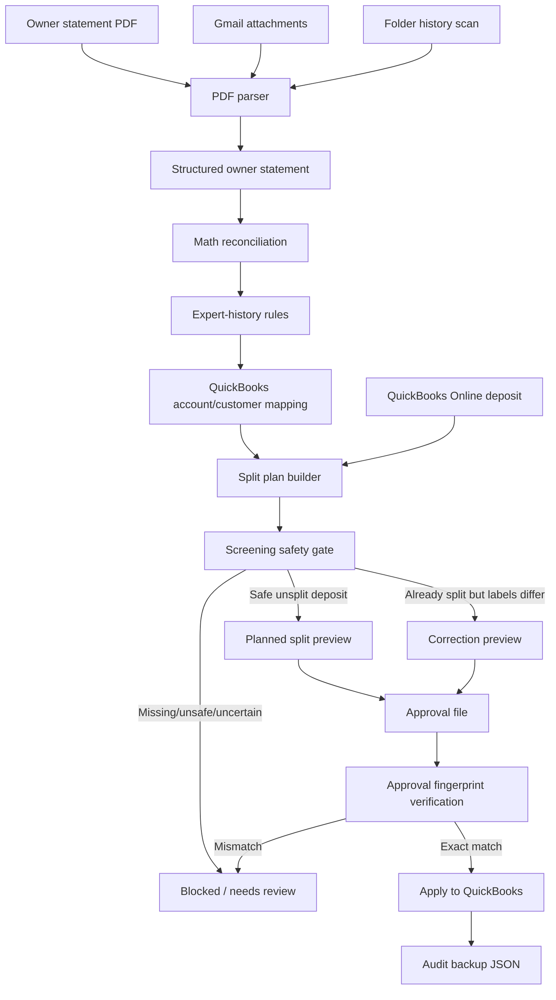
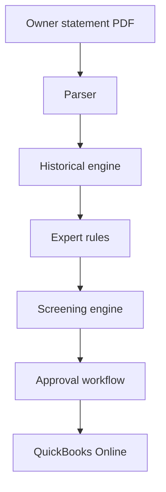
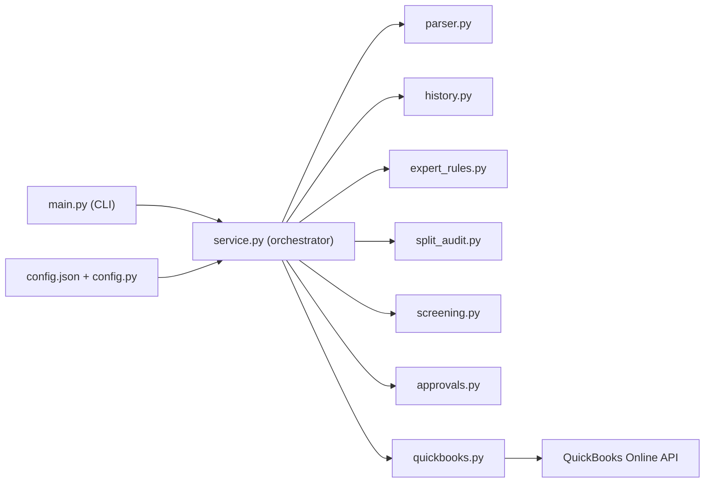
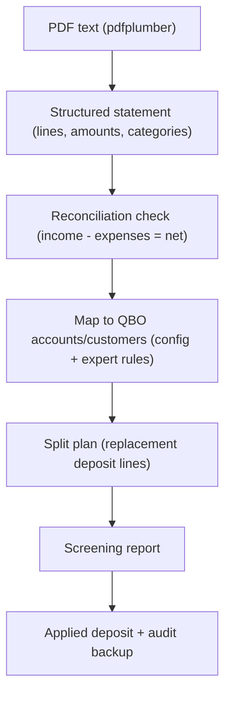
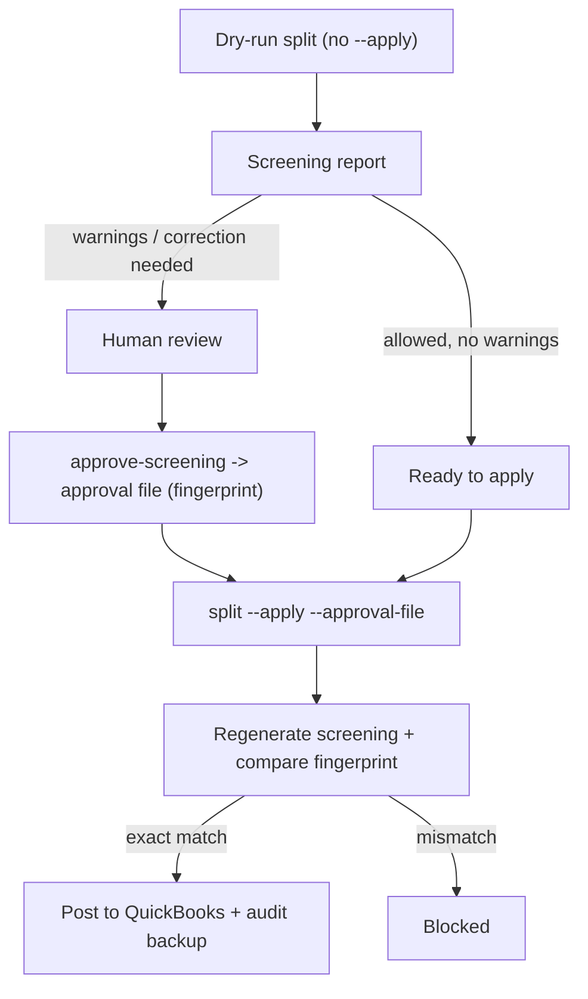
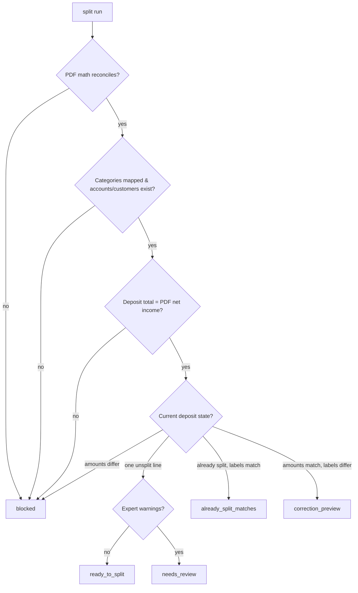
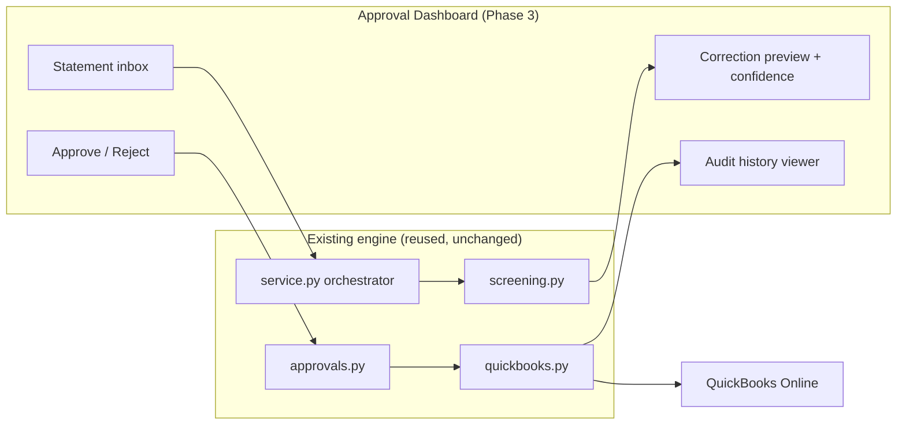
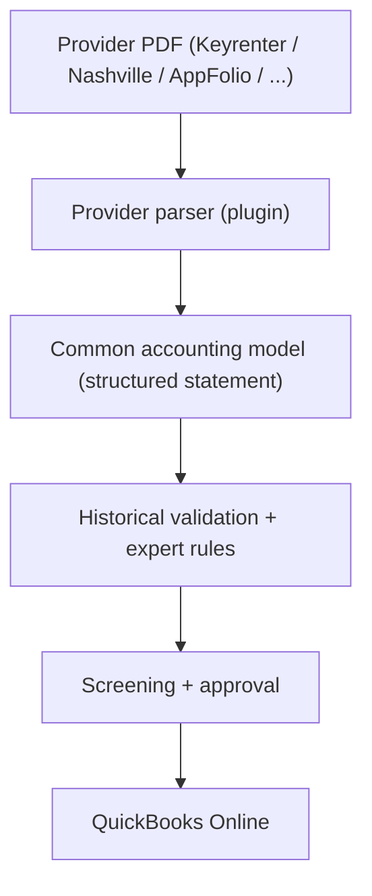

# Audit Trail — Architecture

Last updated: 2026-06-29

> Related: engineering standards in [ENGINEERING_PRINCIPLES.md](ENGINEERING_PRINCIPLES.md),
> phased plan in [ROADMAP.md](ROADMAP.md), release goals in
> [RELEASE_CHECKLIST.md](RELEASE_CHECKLIST.md), operations in [COMMANDS.md](COMMANDS.md).

## Purpose

This project is being built to automate QuickBooks Online bank-deposit splits from owner-statement PDFs while keeping a strict safety net around the data.

The system should eventually run automatically, but the design principle is:

> Automate the work, not the mistakes.

If the PDF, QuickBooks deposit, accounts, customers, history rules, and approval checks do not agree, the system stops instead of posting bad data.

## High-level architecture



## Architecture diagrams

The high-level flowchart above shows the full safety path. The diagrams below break out
specific views for readability. (All diagrams are Mermaid; GitHub renders them inline.)

### Overall processing pipeline (simplified)



### Component relationships (modules)



### Data flow (PDF to posted deposit)



### Approval workflow



### Screening decision process



### Planned UI architecture (Phase 3 — future)

The future dashboard is a thin front end over the **existing** engine; the safety
guarantees stay in the same modules.



## Supported providers and provider-plugin architecture

Owner statements come from different property-management platforms, each with its own PDF
layout. The accounting engine downstream is provider-agnostic — only the **parser** is
provider-specific.

### Currently supported
- **Keyrenter** (Springfield owner packets)
- **Sample PM**

### Future provider candidates
- **AppFolio** (the portal Keyrenter packets originate from — see [ROADMAP.md](ROADMAP.md))
- **Buildium**
- **Propertyware**
- **Rent Manager**
- Others as the need arises

### Design goal: add a provider = add a parser
The long-term architecture separates provider-specific parsing from the shared accounting
pipeline, so onboarding a new provider should require implementing **only a new parser**
that emits the common accounting model — not changes to historical validation, screening,
approval, or the QuickBooks layer.



This keeps the trustworthy core (reconciliation, screening, approval, audit) stable while
the only variable part — reading a particular PDF format — is isolated and independently
testable.

## Main layers

### 1. Inputs

The automation can work from:

- a single PDF passed in the terminal,
- a folder of PDFs for history/audit,
- Gmail PDF attachments.

Current important folders:

```text
D:\Quickbooks Automation Testing\Owner Statements 2021-2026\keyrenter history
D:\Quickbooks Automation Testing\Owner Statements 2021-2026\nashville history
```

### 2. PDF parsing layer

Main file:

```text
app\parser.py
```

The parser extracts:

- statement owner/property,
- statement month,
- income total,
- expense total,
- net owner payment,
- each line item,
- amount,
- source category,
- transaction date when available,
- source property/customer,
- source description text.

Supported statement formats:

- Sample PM owner statements,
- Keyrenter Springfield owner packets.

The parser must reconcile the PDF math before the run can continue.

If:

```text
income - expenses != net income
```

then the parser stops.

### 3. Expert-history rules layer

Main file:

```text
app\expert_rules.py
```

The parser reads what the PDF says. The expert-history layer converts broad or ambiguous PDF labels into the QuickBooks labels that were used historically by expert-posted QuickBooks splits.

Examples:

| PDF/source signal | QuickBooks label |
|---|---|
| Owner Contribution | Partner investments |
| Property Reserve / Property Cash Reserve | Partner distributions:Property Cash Reserve |
| Admin Fee | Sales:Rental Income:Admin Fee |
| explicit Transfer to/from another property | Partner investments:Transfer funds to other property account |
| HVAC / heating work | Repairs & maintenance:HVAC |
| water/sewer utility bill | Utilities:Water & sewer |
| gas vacant utility/final bill | Gas Utility |
| Move Out Refund | Move Out Refund |
| Leasing Fee | Commissions & fees:Leasing Fee |

This layer is deliberately conservative. When the text looks mixed, duplicated, or unclear, it creates warnings instead of silently trusting the result.

Warning types include:

- `unclassified_line`
- `duplicate_or_similar_amounts`
- `mixed_pdf_context`

Warnings do not necessarily mean the split is wrong. They mean the system wants review before applying.

### 4. Configuration and mapping layer

Main files:

```text
config.json
app\config.py
```

The config maps PDF categories/properties to QuickBooks names.

Examples:

```json
"category_accounts": {
  "Rental Income": "Sales:Rental Income",
  "Property Reserve": "Partner distributions:Property Cash Reserve",
  "Owner Contribution": "Partner investments"
}
```

For Keyrenter, the config also maps property classes to QuickBooks customers:

```json
"customer_by_property_class": {
  "742 Maple Ave": "742 Maple Ave",
  "88 Birch Lane": "88 Birch Lane"
}
```

If an account or customer name does not exist in QuickBooks, the run stops.

### 5. QuickBooks access layer

Main file:

```text
app\quickbooks.py
```

This layer:

- authorizes with QuickBooks Online,
- reads deposits,
- searches deposits by amount/date/memo,
- reads accounts/customers,
- builds the QuickBooks update payload,
- applies the update only when allowed.

It refuses unsafe deposits, including deposits with linked/non-editable lines.

### 6. Split plan layer

Main files:

```text
app\quickbooks.py
app\service.py
```

The split plan is the proposed QuickBooks deposit update.

It contains:

- original deposit backup,
- replacement deposit lines,
- QuickBooks account refs,
- QuickBooks customer refs,
- descriptions,
- total validation.

The planned split total must equal the PDF net income.

### 7. Screening safety gate

Main file:

```text
app\screening.py
```

Every split run creates a screening report before anything can be posted.

The screening report checks:

| Check | Purpose |
|---|---|
| PDF math reconciles | Prevent bad extraction |
| deposit total matches PDF net income | Prevent wrong deposit/month |
| categories are mapped | Prevent unknown accounts |
| accounts exist in QBO | Prevent invalid posting |
| customers exist in QBO | Prevent invalid property/customer |
| current line count | Detect unsplit vs already split |
| current line amounts | Prevent changing money unintentionally |
| current labels | Detect account/customer differences |
| expert warnings | Require review when text is risky |

Possible screening statuses:

| Status | Meaning |
|---|---|
| `ready_to_split` | One-line deposit is clean and ready |
| `needs_review` | Planned split exists, but warnings require review |
| `already_split_matches` | QuickBooks already matches expected split |
| `correction_preview` | Amounts match, but labels differ |
| `blocked` | Unsafe or missing information |

### 8. Approval mechanism

Main file:

```text
app\approvals.py
```

Approval files let reviewed results pass the safety gate without weakening the safety gate.

An approval is created from a reviewed screening JSON file.

The approval stores a fingerprint of:

- deposit ID,
- statement month,
- current deposit total,
- expected PDF total,
- current split preview,
- planned split preview,
- correction preview,
- expert-rule changes,
- expert-rule warnings,
- missing categories,
- line count and amount checks.

When applying, the system regenerates the screening report and compares it to the approval file.

If anything changed, apply is blocked.

Approved scenarios:

1. First-time split approval
   - current deposit has one line,
   - total matches PDF,
   - planned split preview exists,
   - approval fingerprint matches.

2. Existing split correction approval
   - current and expected line amounts match,
   - labels differ,
   - correction preview exists,
   - approval fingerprint matches,
   - `--allow-resplit` is also provided.

### 9. Apply layer

Main files:

```text
app\service.py
app\quickbooks.py
```

Apply only happens when:

- `--apply` is explicitly used,
- screening allows it or a valid approval file allows it,
- for already-split corrections, `--allow-resplit` is explicitly used,
- the QuickBooks payload is valid.

Before applying, the system saves an audit backup JSON under:

```text
runtime\audit
```

## Command architecture

The main entry point is:

```text
main.py
```

Safe/read-only commands:

```text
parse
history
qbo-deposit
qbo-deposits
qbo-accounts
qbo-customers
audit-split
split without --apply
approve-screening
```

Potentially changes QuickBooks:

```text
split --apply
```

Even `split --apply` is blocked unless screening/approval allows it.

## Environment architecture

QuickBooks environment is controlled through `.env`.

Important variables:

```text
QBO_ENVIRONMENT=sandbox or production
QBO_TOKEN_FILE=secrets/qbo_token_sandbox.json or secrets/qbo_token.json
QBO_REDIRECT_URI=...
```

Sandbox and production are separate QuickBooks companies. Deposit IDs from live usually do not exist in sandbox.

Current sandbox test deposit mapping:

| Sandbox ID | Month | Amount |
|---:|---|---:|
| `148` | March 2025 | `4496.33` |
| `149` | June 2025 | `6273.93` |
| `150` | August 2025 | `4689.89` |
| `151` | September 2025 | `3604.60` |

Live review deposit mapping:

| Live ID | Month | Amount |
|---:|---|---:|
| `492` | March 2025 | `4496.33` |
| `534` | June 2025 | `6273.93` |
| `532` | August 2025 | `4689.89` |
| `531` | September 2025 | `3604.60` |

## Current sandbox issue

The corrected sandbox IDs now match the PDF totals, but the approval attempt still returned `not_approved` because the screening files have:

```text
status: blocked
expected_line_count: null
line_amounts_match: null
account_customer_labels_match: null
```

That means the system did not reach planned split creation.

Next diagnostic command:

```powershell
foreach ($file in @(
  "runtime\sandbox-screening-148-march-2025.json",
  "runtime\sandbox-screening-149-june-2025.json",
  "runtime\sandbox-screening-150-august-2025.json",
  "runtime\sandbox-screening-151-september-2025.json"
)) {
  $j = Get-Content $file -Raw | ConvertFrom-Json
  ""
  "===== $file ====="
  $j.screening | Select-Object status,current_deposit_total,expected_pdf_total,total_matches,missing_categories,reasons | Format-List
  $j.plan | Format-List
}
```

Likely causes:

- latest files were not copied into `D:\Downloads\qbo-owner-statement-automation`,
- sandbox lacks the same accounts/customers as live,
- `config.json` maps to names that do not exist in sandbox,
- screening files were generated before the latest code update and need rerunning.

## Future production architecture

The eventual fully automated system should look like this:

1. scheduled job checks Gmail,
2. downloads new owner-statement PDFs,
3. parses and reconciles PDFs,
4. finds matching QuickBooks deposits,
5. creates screening report,
6. if clean first-time split: apply or queue for approval depending on chosen policy,
7. if warnings/corrections: send review notification,
8. approval file or UI approval unlocks apply,
9. apply stores audit backup,
10. final report is emailed/logged.

Recommended future additions:

- a small local dashboard for reviewing screenings,
- approved correction files stored in a dedicated folder,
- email notification for `needs_review` and `blocked`,
- daily run log,
- duplicate-email/PDF protection,
- explicit environment banner before apply,
- one-click sandbox/live verification checklist.
